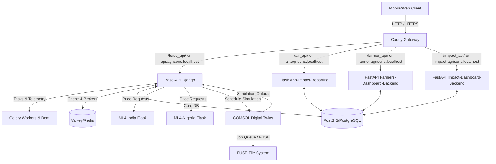

# Agricool / Coldtivate System Documentation & Integration Guide

Welcome to the comprehensive system documentation for the **Agricool / Coldtivate** backend platform. This document outlines the architectural design, setup procedures, and a detailed integration guide for frontend clients.

---

## 1. System Architecture Overview

The Agricool platform is built as a microservices architecture consisting of **8 distinct services** managed under Docker. The Caddy gateway reverse-proxies incoming HTTP requests based on either request domains or specific URL path prefixes.



### Services Breakdown

1. **Gateway (`caddy`)**: 
   - A reverse proxy that routes frontend client traffic to the appropriate backend service.
   - Inject CORS headers and handle TLS configuration.
   - Serve media files directly from local storage (`/media/*`).
2. **Base-API (`web` / `celery`)**:
   - The core monolithic Django REST application handling PostgreSQL database updates, user roles and authorizations, checkout billing calculations, Paystack payment processing, and sensor telemetry.
   - Valkey (Redis-compatible) serves as the Celery task broker and backend cache.
3. **Farmers-Dashboard-Backend (`farmer_web` / `farmer_scheduler`)**:
   - A FastAPI service designed to query, slice, and aggregate farmer records for visual display in the Farmers Dashboard interface.
4. **Impact-Dashboard-Backend (`impact_dashboard_web` / `impact_dashboard_scheduler`)**:
   - A FastAPI service slicing and aggregating environmental impact data, CO2 metrics, and crop-wise performance stats for service providers.
5. **App-Impact-Reporting (`vcca_air_service`)**:
   - A Flask app generating complex `.xlsx` Excel downloads containing usage reports, revenue analysis sheets, and user indexes.
6. **Comsol-Digital-Twins (`comsol_dt_service`)**:
   - A Flask service that processes COMSOL physics simulations. It manages a FIFO job queue, runs calculations against a model mounted on a virtual FUSE filesystem, and hits a callback on `Base-API` once the crate's quality metrics and remaining shelf life are calculated.
7. **ML4-India (`scraping_india`)**:
   - A Flask microservice that serves XGBoost model predictions. It forecasts market prices up to 14 days into the future for Apple, Banana, Green Chilli, and Tomato.
8. **ML4-Nigeria (`scraping_nigeria`)**:
   - A Flask microservice exposing model predictions. It forecasts prices up to 8 months into the future for Onion, Plantain, Tomato, Irish Potato, and Sweet Potato.

---

## 2. Environment Setup & Installation

The project uses Docker Compose to manage dependency services and network bindings. 

### Prerequisites
- Docker & Docker Compose (stable/latest)
- Python 3.8+ & Pipenv (for local non-docker tooling)
- Git LFS (Git Large File Storage) enabled (critical for pulling pickled ML models)

### Step-by-Step Local Setup

1. **Clone the Repository with LFS**:
   ```bash
   git clone <repository-url>
   cd agricool-backend
   git lfs pull
   ```

2. **Configure Environment Files**:
   Create a `.env.development` file in the root directory. You can duplicate `.env.production` or customize the following variables:
   ```ini
   ENVIRONMENT=development
   DEBUG=True
   SECRET_KEY=dev_secret_key_change_me
   DB_NAME=base
   DB_USERNAME=base
   DB_PASSWORD=base
   DB_HOST=db
   DB_PORT=5432
   REDIS_HOST=valkey
   REDIS_PORT=6379
   TWILIO_SID=your_twilio_sid
   TWILIO_AUTH=your_twilio_auth
   TWILIO_NUMBER=your_twilio_phone_number
   PAYSTACK_SECRET_KEY=your_paystack_secret_key
   COMSOL_CALLBACK_KEY=comsol_callback_key_here
   RECAPTCHA_ENABLED=false
   ```

3. **Launch with Docker Compose (Development)**:
   ```bash
   docker compose -f docker-compose.yml -f docker-compose.development.yml up --build
   ```

4. **Verify Running Services**:
   - **Gateway (Caddy)**: Listening on `http://localhost:80`
   - **Base API**: `http://localhost:8000`
   - **Farmers Dashboard API**: `http://localhost:8003`
   - **Impact Dashboard API**: `http://localhost:8001`
   - **Excel Reports API**: `http://localhost:8002`

---

## 3. Step-by-Step Frontend Integration Guide

This section outlines how the frontend application should interact with the Agricool platform.

### Phase 1: Authentication & Account Setup
1. **User Login**: Call `POST /v1/login/` with the user credentials and `user_type` parameter (options: `"sp"` for Service Provider, `"op"` for Operator, `"f"` for Farmer).
2. **Access token usage**: Attach the returned JWT `access` token in the header (`Authorization: Bearer <access_token>`) for all authenticated endpoints.
3. **Token Refresh**: When the access token expires (typically after 15 minutes), call `POST /token/refresh/` with the `refresh` token to get a new access token.

### Phase 2: Operator Workflows (Cooling Unit Check-in / Check-out)
1. **Check-in Process**:
   - Call `POST /operation/checkins/` when a farmer brings produce.
   - Pass the `farmer_id` (or user ownership fields) and a JSON string array of `produces` details containing `crop_id`, `cooling_unit_id`, and crate `weight`.
   - The platform will create `Produce` and `Crate` instances and schedule a COMSOL Digital Twin task to compute quality details if the crop is supported.
2. **Check-out Process**:
   - Call `POST /operation/checkouts/` to check out crates.
   - Specify the `crates` array. The API calculates the final billing based on the cooling unit's pricing rate and crate weight.
3. **Move Crate**:
   - To transfer checked-out crates to a new cooling unit, fetch checkout details via `GET /operation/move-checkout/?code=<movement_code>`.
   - Complete the action by posting parameters to `POST /operation/move-checkout/`.

### Phase 3: Marketplace Workflow
#### Seller Flow
1. **Paystack Setup**: Create a payout account by posting bank details to `POST /marketplace/seller/paystack-accounts/`.
2. **Listing Crates**: List storage crates for sale by calling `POST /marketplace/seller/listed-crates/` specifying crate IDs and price per kg.
3. **Coupon Management**: Optionally create coupon codes using `POST /marketplace/seller/coupons/`.

#### Buyer Flow
1. **Find Listings**: Call `GET /marketplace/buyer/available-listings/` sending `lat` and `lng` to search for available crates sorted by distance.
2. **Manage Cart**: 
   - Add/update item weights via `POST /marketplace/buyer/cart/items/`.
   - Select pickup options via `POST /marketplace/buyer/cart/set-pickup-details/`.
   - Apply discount codes using `POST /marketplace/buyer/cart/apply-coupon/`.
3. **Paystack Checkout**:
   - Call `POST /marketplace/buyer/cart/checkout-with-paystack/`.
   - The backend validates weights/listings and returns an `authorization_url` redirecting the user to complete the credit card transaction.
   - Paystack webhooks will notify `/marketplace/webhooks/paystack/` to confirm payment and transfer ownership.

### Phase 4: Price Predictions (ML4)
1. **Fetch Parameters**:
   - India: `GET /prediction/v1/states/get_parameters_for_prediction/`
   - Nigeria: `GET /prediction/v1/statesng/get_parameters_for_prediction/`
2. **Get Graphs**:
   - Call `POST /prediction/predictions/get_data_graph` (or `_ng` suffix) to plot historical vs predicted values.
3. **Get Tables**:
   - Call `POST /prediction/predictions/get_data_table` (or `_ng` suffix) to display a tabular breakdown.

---

## 4. API Endpoint Reference

### Headers
All authenticated API calls require the following authorization header:
```http
Authorization: Bearer <JWT_ACCESS_TOKEN>
```
Endpoints handling file uploads or JSON payloads should specify:
```http
Content-Type: application/json
```

---

### Category A: Authentication

#### 1. User Login
- **URL**: `/v1/login/`
- **Method**: `POST`
- **Authentication**: None
- **Request Body**:
  ```json
  {
    "username": "+2348000000000",
    "password": "userpassword",
    "user_type": "op",
    "language": "en"
  }
  ```
- **Responses**:
  - `200 OK`:
    ```json
    {
      "refresh": "eyJ0eXAi...",
      "access": "eyJ0eXAi...",
      "user": {
        "id": 5,
        "first_name": "John",
        "last_name": "Doe",
        "gender": "M",
        "phone": "+2348000000000",
        "last_login": "2026-06-09T11:00:00Z"
      },
      "role": "Operator",
      "company": {
        "id": 1,
        "name": "AgriCool Co"
      }
    }
    ```

#### 2. Token Refresh
- **URL**: `/token/refresh/`
- **Method**: `POST`
- **Authentication**: None
- **Request Body**:
  ```json
  {
    "refresh": "eyJ0eXAi..."
  }
  ```
- **Responses**:
  - `200 OK`:
    ```json
    {
      "access": "eyJ0eXAi..."
    }
    ```

---

### Category B: Operator Operations

#### 1. Create Check-in
- **URL**: `/operation/checkins/`
- **Method**: `POST`
- **Authentication**: Required (Operator)
- **Request Body**:
  ```json
  {
    "farmer_id": 12,
    "produces": "[{\"crop\": {\"id\": 37}, \"crates\": [{\"cooling_unit_id\": 1, \"weight\": 25.5, \"planned_days\": 10}], \"has_picture\": false}]"
  }
  ```
- **Responses**:
  - `200 OK` (Check-in details returned).

#### 2. Create Checkout
- **URL**: `/operation/checkouts/`
- **Method**: `POST`
- **Authentication**: Required (Operator)
- **Request Body**:
  ```json
  {
    "crates": [101, 102],
    "payment_through": "cash",
    "payment_method": "direct",
    "currency": "NGN"
  }
  ```
- **Responses**:
  - `200 OK` (Checkout totals computed and returned).

#### 3. Checkout to Checkin (Crate Movement)
- **URL**: `/operation/move-checkout/`
- **Method**: `POST`
- **Authentication**: Required
- **Request Body**:
  ```json
  {
    "params": {
      "code": "CHK-93041",
      "cooling_unit_id": 2,
      "farmer": 12,
      "days": 10
    }
  }
  ```
- **Responses**:
  - `200 OK`:
    ```json
    {
      "message": "Successfully moved crate"
    }
    ```

---

### Category C: Marketplace (Buyer & Seller)

#### 1. Register Seller Paystack Account
- **URL**: `/marketplace/seller/paystack-accounts/`
- **Method**: `POST`
- **Authentication**: Required (Seller)
- **Request Body**:
  ```json
  {
    "account_type": "user",
    "bank_code": "058",
    "country_code": "NG",
    "account_number": "0123456789",
    "account_name": "John Doe Enterprises"
  }
  ```
- **Responses**:
  - `201 Created` (Account details returned).

#### 2. List Crates for Sale
- **URL**: `/marketplace/seller/listed-crates/`
- **Method**: `POST`
- **Authentication**: Required (Seller)
- **Request Body**:
  ```json
  {
    "crate_ids": [101, 102],
    "produce_price_per_kg": 350.00
  }
  ```
- **Responses**:
  - `200 OK` (List of active market crate listing details).

#### 3. Search Available Market Listings
- **URL**: `/marketplace/buyer/available-listings/`
- **Method**: `GET`
- **Authentication**: None / Optional
- **Query Parameters**:
  - `lat` (float, required): Latitude of the buyer.
  - `lng` (float, required): Longitude of the buyer.
  - `sort_by` (str): Sort method (`price-asc`, `price-desc`, `distance`).
  - `page` (int): Page number (default: 1).
  - `items_per_page` (int): Size limit (default: 20).
- **Responses**:
  - `200 OK`:
    ```json
    {
      "pagination": {
        "count": 45,
        "num_pages": 3,
        "current_page": 1
      },
      "nodes": [
        {
          "id": 1,
          "crate": {
            "id": 101,
            "weight": 25.5
          },
          "currency": "NGN",
          "distance": 4.2,
          "prices": {
            "produce_price_per_kg": 350.00
          }
        }
      ]
    }
    ```

#### 4. Add Item to Cart
- **URL**: `/marketplace/buyer/cart/items/`
- **Method**: `POST`
- **Authentication**: Required
- **Request Body**:
  ```json
  {
    "crate_id": 101,
    "update_strategy": "replace",
    "ordered_produce_weight": 10.0
  }
  ```
- **Responses**:
  - `200 OK` (Cart breakdown returned).

#### 5. Apply Coupon Code
- **URL**: `/marketplace/buyer/cart/apply-coupon/`
- **Method**: `POST`
- **Authentication**: Required
- **Request Body**:
  ```json
  {
    "coupon_code": "WELCOME10"
  }
  ```
- **Responses**:
  - `200 OK` (Updated cart reflecting discount details).

#### 6. Checkout with Paystack
- **URL**: `/marketplace/buyer/cart/checkout-with-paystack/`
- **Method**: `POST`
- **Authentication**: Required
- **Request Body**: None (Uses currently active cart)
- **Responses**:
  - `200 OK`:
    ```json
    {
      "order_id": 431,
      "authorization_url": "https://checkout.paystack.com/abcdefgh"
    }
    ```

---

### Category D: Price Predictions

#### 1. Fetch Market and Crop Parameters (India)
- **URL**: `/prediction/v1/states/get_parameters_for_prediction/`
- **Method**: `GET`
- **Authentication**: Required
- **Responses**:
  - `200 OK`:
    ```json
    {
      "available_crops": [
        {"id": 1, "name": "Tomato"}
      ],
      "available_markets": {
        "Maharashtra": {
          "Pune": [
            {"id": 4, "name": "Pune Market"}
          ]
        }
      }
    }
    ```

#### 2. Get Prediction Graph Data (India)
- **URL**: `/prediction/predictions/get_data_graph`
- **Method**: `POST`
- **Authentication**: Required
- **Request Body**:
  ```json
  {
    "marketId": 4,
    "cropId": 1
  }
  ```
- **Responses**:
  - `200 OK`:
    ```json
    {
      "pastValues": [
        {"date": "2026-05-15", "price": 1200}
      ],
      "forecastsValues": [
        {"date": "2026-06-10", "price": 1250, "only_interpolated_data": false}
      ]
    }
    ```

---

### Category E: Dashboard Queries (FastAPI)

#### 1. Farmer Dashboard Slicing
- **URL**: `/farmer_api/farmer-slice/` (through Gateway) or port 8003
- **Method**: `POST`
- **Authentication**: None (handled by network structure/Gateway)
- **Content-Type**: `application/x-www-form-urlencoded`
- **Request Body**:
  ```ini
  farmer_id=12
  unit_ids=1,2
  start_date=2026-01-01
  end_date=2026-06-01
  ```
- **Responses**:
  - `200 OK` (Returns double dictionary format containing baseline data frames).

---

### Category F: Excel Exporter

#### 1. Download Usage Analysis Excel Report
- **URL**: `/air_api/company/<company_id>/usage_analysis` (through Gateway) or port 8002
- **Method**: `GET`
- **Authentication**: None
- **Query Parameters**:
  - `cooling_unit_ids` (str): Comma-separated unit IDs.
  - `start_date` (str): "YYYY-MM-DD"
  - `end_date` (str): "YYYY-MM-DD"
- **Responses**:
  - `200 OK` (binary attachment stream with header `Content-Type: application/vnd.openxmlformats-officedocument.spreadsheetml.sheet`).
